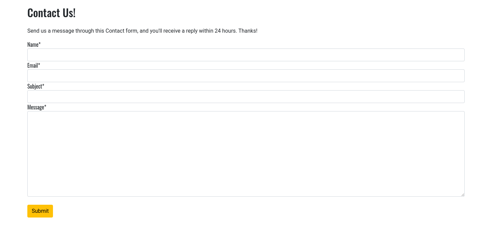
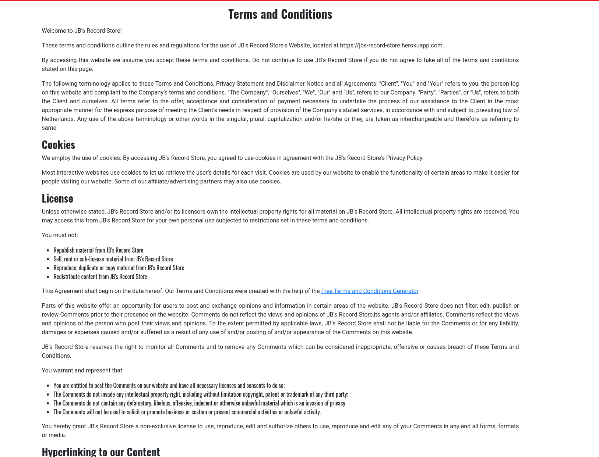

# JB's Record Store

JB's Record Store is a small-scale B2C e-commerce store selling physical music albums on LP, CD and Cassette. The site is targeted towards users who are interested in music and building their physical music collection, an industry that's experienced a major revival over the past number of years. 

Users can browse and purchase a range of music based on their interests. They can browse the store by either format (CD, LP or Cassete) or by musical genre - options for both are available from the main site navigation. They can also read reviews left by other users of the site, and can reach out to the site administrator if needed, either through the site Contact form or else via the store's social media accounts.

The store uses Stripe to handle payments. As this site was built for educational purposes, please do not enter any live card details into the checkout page. For testing purposes, Stripe's test card details can be used - you can find a link to these details in Stripe's documentation [here](https://stripe.com/docs/testing#cards).

The live link can be found here - [JB's Record Store](https://jbs-record-store.herokuapp.com/)

## User Stories

#### EPIC: Site Content & Navigation
- As a Site User, I can navigate around the site so that I can find content that's relevant to what I am looking for.
- As a site User I can immediately understand the purpose of the site so that I can learn information about the website.
- As a Site User I can view a list of products so that I can select a product that I'm interested in, to view or purchase.
- As a Site User I can click on a product on the main Store page so that I can view extra information about the product.
- As a Site User I can browse the store by product category so that I can find music that's part of the genre I'm interested in.
- As a Site User I can read reviews/testimonials left by other users.
- As a Site User I can have easy access to the Terms & Conditions under which the store operates, and also the store's Privacy Policy.

#### EPIC: User accounts & Profile
- As a new site user I can create an account so that I can be a registered user.
- As a site user I can verify my site membership through an email confirmation so that I can provide extra approval for my site membership.
- As a registered site user I can log in or log out of my account as appropriate so that I can access my user account as required.
- As a site user I can recover or reset my password so that I can gain access to the logged-in features if I have forgotten my login details.
- As a Site User I can view and update my registered shipping address and view previous orders so that I can ensure that my shipping address is correct and view information relating to previous orders.

#### EPIC: eCommerce Functionality
- As a site user I can add products to my shopping bag so that I can purchase them when ready.
- As a site user I can view the contents of the shopping bag at any stage so that I can see the contents along with the current total cost.
- As a Site User I can complete a purchase so that I can buy something without having to register for an account.
- As a Site User I can view a detailed order confirmation after checkout so that I can see all the details of the order I've placed.
- As a site user I can receive an email to confirm my order so that I have a personal copy of the order that I've placed.

#### EPIC: Store Management & Administration
- As a site administrator I can create, update and delete products within the store so that I can manage the items currently for sale.
- As a site administrator I can update and delete registered users so that I can manage the users that have registered on the site.
- As a site administrator I can review and approve customer reviews within the admin panel so that I can add customer reviews to my site, to improve trust in me as a seller.
- As a site administrator I can manage and respond to messages sent through the site contact form so that I can engage with my customers.

#### EPIC: User Interaction
- As a site user I can contact the store owner so that I can send through questions or enquiries to the store owner.
- As a site user I can sign up to the store's newsletter so that I can receive updates on new products being added and/or promotions.
- As a site user I can have the option to visit the store's social media accounts so that I can follow the store through these channels, to learn about current and future products for sale.
- As a site user I can leave reviews of my experience on the site as a buyer so that I can express my views that inform future and existing users of the site.

#### User Stories not yet implemented

The following user story was scoped out of the project at this stage, due to time constraints. It was marked as "Won't-have" within the project board in GitHub Projects. This functionality will be returned to at a later date.

- As a site administrator I can avail of automated stock management within the site so that the stock levels of items in the store can decrease automatically once a customer places an order, and I can be notified through email that stock levels of products are running low.

## Site Design

The site uses a simple and clean design which sticks to minimalistic colours and design thinking. There's a single static image on the site landing page, along with a grid-style Product page with an image thumbnail, product title and assorted information greeting the user. The site uses bright yet contrasting colours to make it easy for the user to navigate around the site. 

#### Fonts

The Oswald font is used within the site for heading areas, whereas the Roboto font is used for paragraph areas and buttons within the site. These fonts complement each other well. The fonts are imported from Google Fonts. As per best practice, Sans Serif is added as a backup font in case the main site fonts are not being imported for any reason.

#### Wireframes

 
Homepage

Store Page

Reviews page

Contact page

## Agile Methodology

Github Projects was used to manage the development requirements and process. There's a link to the project board [here](https://github.com/users/JBurrellIRL/projects/3) .

The project comprises of 5 Epics, which are listed within the project as Milestones. A Github Issue was created for each User Story. The User Stories each contain Acceptance Criteria, to make it more clear as to when each User Story has been completed.

## Database Schema

During development, SQLite was used for the site database and for production, ElephantSQL was used in conjunction with Heroku to deploy the live site. Below is an image displaying how the database models relate to each other.

## Security

- The database URL and secret key needed to access the database are stored as environment variables in the env.py file, and as config variables in Heroku. I ensured not to push any sensitive information to GitHub on any initial commits, to ensure the integrity and security of my database.
- Cross-Site Request Forgery (CSRF) tokens were used on all forms throughout this site, to ensure the integrity of the forms.
- Django's LoginRequiredMixin is used for the relevant class-based views in order to restrict access to authenticated users only. Non-authenticated users are redirected to the login page. The UserPassesTestMixin is used to ensure that only the customer that left a review (or the site admin) can edit the review through the front-end of the site.
- For Django function-based views, the login_required decorator is used to restrict access as required.
- I created custom 404 and 403 error pages, to inform the user of the applicable error. These pages also include buttons to return the user to the site homepage.

## Site Features

### Header

**Site Title**

- The user is greeted with a site title, positioned to the left, which is clearly defined in the site header. The site title returns the user to the homepage if clicked.

**Navigation**

- The navigation bar is positioned at the top of each page in the site, and includes links to the most popular pages within the site.
- The navigation bar items display differently depending on whether or not the site visitor is logged in. 
- If the visitor is logged out, they'll see an option to either register for an account or to log into an existing account:

- If the visitor has logged in or registered, the options to register or log in are replaced by a user icon (from Font Awesome) and their username, to show them that they are logged in under that username. Clicking on the username opens a dropdown menu, where the user has an option to go to their profile, add a new product (if logged in as the superuser) or to Logout.

- The navigation bar also includes a shopping bag, which can be clicked on to reach the shopping bag page. Beside this is a field that shows the running total of the contents of the shopper's bag. This updates dynamically as the shopper adds items to their bag:

- The navigation bar uses Bootstrap classes and is fully responsive to screens of different sizes. It switches to a "hamburger" menu at 992px:

- The dropdown menus within the hamburger menu retain a white background, so that they're easy for the user to navigate on a mobile device:

### Footer

- The site footer includes links to Terms/Conditions, Privacy Policy. Customer Reviews and other important pages within the site.
- There's also links to Facebook, Twitter and Instagram along with a link to my personal Discogs record collection catalogue. 
- The external links are coded to open in a new browser tab, so that the visitor is not taken away from the website. The internal links open in the same tab.
- There's also a reference to me as the site designer, along with a link to my personal website.

### Home Page

**Welcome section**

-The home page includes a welcome image and a "Shop Now" button to encourage the user to go to the Product Page. It also includes a brief welcoming paragraph to educate the user on the purpose of this store. Some important keywords are added in `<strong></strong>` tags for the benefit of search engine indexing.

**General Information section**

-This part of the homepage includes general information about the store, positioned in responsive cards. The cards contain information useful to the user, and directs them to other areas of the site for further information:

**Marketing & About Me section**

-The next section includes a newsletter block that allows the site visitor to sign up to my mailing list. The mailing list is set up via the Mailchimp marketing platform. The text blurb to the right of this includes some brief information about me.

### User Account Pages

**Sign Up**

**Log In**

**Log Out**

- I used the django-allauth package to create the Sign up, Log in and Log out functionality.
- The user receives messages in their browser to confirm whether or not their login attempt has been successful. They also receive notifications if they've made an error in one of the sign-up or login fields.
- When a user signs up for an account they must verify their membership by clicking on the authentication link emailed to the address they provided.
- If a user forgets their password they can reset it by clicking the 'Forgot Password' on the log in and registration pages.

### User Profile

**Shipping information**

- The shipping address section stores the user's shipping address and phone number.
- The information provided here can be used to autofill the address fields at checkout, to save the customer time.
- There's also an option here for the customer to change their login password, if they wish to.

**Previous Orders**

- The order history section displays a list of all previous orders placed by the customer.
- The display includes the order number, date the order was placed and order total.
- Clicking the order number will take the user to a summary page of that order, with a note stating that the confirmnation shown is of a previous order, not a new one.

### Store Page

**Store Landing Page**

- The user can reach the products page by either clicking on the "Shop Now" button on the homepage, or via the site navigation. The user has an option to browse by either music genre or physical format from the site navigation. In both the Genre and Format dropdown menus, the user sees an option to browse either by "All Products", which returns all products (paginated to 8 products per page) or by the category filter that they choose.
- The landing page is fully responsive, and changes the number of products per row based on the width of the user's browser window.
- The user will see a product thumbnail image, artist, format, genre, price and an excerpt description.
- The user has an option to add an item to their shopping cart on the landing page. 
- If the user is logged in as a store administrator, they'll also see buttons for Editing and Deleting products under the Add to Cart button.

**Product Detail Page**

- After clicking on an individual product on the Products page, the user will be taken to the full product details. 
- The product details page displays the product image, artist, format, genre, item condition, Discogs album rating and price, as well as an Add to Cart button. Under everything, the user will see a detailed product description.
- If the user is logged in as a store administrator, they'll also see buttons for Editing and Deleting products above the Add to Cart button.

### Store Management

**Add Product**

- A product can be added to the store by a superuser by clicking on the "Add Product" option in the navigation bar user dropdown menu. This option is only visible to superusers.
- If a user that isn't logged in tries to add a product by using the direct URL to the Add Product page, they'll be redirected to the Sign In page.
- If a user then logs into a non-superuser account, they'll receive a message to say that only store administrators can add products, and be redirected to the homepage.
- The user must fill out the fields marked with asterisks. Otherwise, the user won't be allowed to submit the new product and the browser will activate the next compulsory field.
- The 'description' field is the Summernote WYSIWYG editor, added as an extra Django package. It renders in both the back-end and front-end.
- The SKU field requires a unique value. If a previously-used SKU is entered into this field, the user receives an error to say that this SKU has already been used. 
- The user can upload an image to the product. If they do not, a default image is used. 
- The user will only be able to submit the form if the form does not return any errors. If there's no errors found, they'll receive a success message after submitting the form.

**Edit Product**

- A superuser can choose to edit a product through the front-end on both the main Store page and also the product detail page. 
- If a non-superuser tries to edit the product using the direct editing URL, they're redirected to the login page.
- If the user then logs in as a regular user, they receive an error stating that "only store administrators can do that", and are redirected to the homepage.
- The form opens with the original content rendered.
- The 'description" field is the Summernote WYSIWYG field, as with the Add Product form.
- The image field displays a thumbnail of the existing image, and a checkbox option exists to allow the superuser to clear the existing image. 
- Once the product has been adjusted, the superuser receives a success message to notify them that the product has been successfully updated.

**Delete Product**

- A superuser has the option to delete products through the site back-end, and also through the front-end on both the Store page and also the Product Detail page.
- Clicking on the "Delete" button opens a Bootstrap modal, asking the user if they want to confirm deletion of the product.
- Clicking "Delete" returns a "Product Deleted" message and the product is removed from the database.

**Order management in admin panel**

- Once an order is received, it will appear in the site admin area for the site administrator to view. 
- To help with order management, the site admin also has access to an Order Notes section in the admin panel. Here, the administrator can add a new note and associate it directly with a received order as a foreign key. The administrator can add notes such as the date the order was shipped, tracking numbers etc, and set the order to Fulfilled: Yes or No. This information is stored in the database to help the site administrator with order management.

### Shopping Bag

- When the user clicks on the shopping bag icon in the nav bar they are taken to the Shopping Bag page, which shows the products added to the cart, order total, applicable charge for shipping and overall total to be charged.
- The user also sees a notification about how much extra they need to spend to get free shipping, if they are below the free shipping threshold. If they are above that threshold, this message does not appear.
- The user has an option to return to the Store page by clicking on the "Keep Shopping" button.
- The user can remove items from their shopping bag by clicking on the "Remove" button under the product thumbnail. Upon clicking on this, the shopping bag is updated, as are the order totals.
- If the user removes everything from their shopping bag, they receive a message stating that their shopping bag is empty. The order total fields and the "Go To Checkout" button disappear if this takes place.
- Once ready, the user can then proceed to the checkout page by clicking on the "Go To Checkout" button, as long as there is items in their shopping bag at this stage.

### Checkout area

**Personal Details**

- Within the details section the user can fill out their personal details, shipping address and payment information.
- If the user is a guest, an option to either create a new account or log into an existing account is visible.
- If the user is logged in, a checkbox to save the shipping information to their profile can be selected.
- If the user is signed in and has shipping information saved, the shipping details and email address will auto-populate from the already-saved user profile.
- If a user leaves a required field empty or inputs invalid or empty data, an error will appear to prompt the user to check their inputs.

**Order Summary**

- The Order Summary section lists the items about to be purchased, along with the item subtotal and an order total.
- The order totals give a breakdown of the order total, the cost of shipping and also the grand total to be charged from the customer card.
- The image thumbnail links back to that product's detail page.

**Payment**

- The site payments are handled by the Stripe payment processor. This is a secure payment platform, documentation for it can be found here: https://stripe.com/docs/ .
- Invalid card details will trigger a red warning message stating that the card details entered are invalid.
- After the user clicks to complete payment, a loading screen will be triggered, to let the user know that their transaction is being processed and to discourage them from navigating away before this takes place.
- If the payment form fails or the user closes the browser window before the loading screen disappears, the transaction should still succeed through the inbuilt webhook.
- The payment webhook is designed to search through the database to see if the customer's order exists. If it does not, the webhook will create the order using the customer's details and payment information.

**Order Confirmation**

- Completing the order takes the user to the checkout success page. Here, the user will see a summary of their completed order, including the shipping address, items purchased and order total. The order also receives a randomly-generated order number. This information will also be visible to a registered user under their "Profile" section described earlier.
- The customer will also receive an email to confirm their order.

### Customer Reviews section

- The Customer Reviews page can be reached by clicking on the link to the page in the footer of the site.
- When a user navigates to this page, they can see reviews left by previous users. Each review includes the review itself, the username of the reviewer, the rating given by the user, the date the review was left and an image optionally uploaded by the reviewer. If the user chooses not to upload an image, a placeholder image is used instead. 
- The user must be logged in to be able to leave a review. If the person is logged out, a message will appear to let them know they must be logged in to be able to leave a review.
- Once the review is submitted, it must be approved by the site administrator before it can be viewed on the site.
- After the review is approved and is appearing on the site, a logged-in user will have the option to either edit or delete any reviews left by themselves, through buttons that appear under the "Rating" section.
 
**Add Review page**

- The user can give their review a title, give it a rating and write a paragraph to describe their experience. They can also optionally upload an image to go alongside their review, once it's been approved by the site administrator.
- Once the review is submitted, the customer receives a message to confirm that the review has been received, and is awaiting approval.

**Edit Review page**

- The user can edit reviews left by themselves only. On the main Reviews page, an option to Edit the existing review will appear under the Rating.
- If someone attempts to edit a review attributed to another user through the direct URL to the editing page, they're redirected to the login screen.
- If they log into an account that did not leave the review they're attempting to edit, they see a custom 403 "forbidden" page, with a link back to the site homepage.

**Delete Review**

- A logged-in user will have access to a Delete button on reviews that they've previously left. This button appears under the "Rating" field on the main reviews page.
- Clicking on the "Delete" button triggers a Bootstrap modal, asking the user to provide confirmation for the deletion of the review.
- Clicking "Delete" returns a "Review Deleted" message and the review is permanently removed from the database.

### Contact Form

- A user can open the Contact Us page from either the main top navigation or the footer navigation. 
- The user can submit a query through the form by filling out each field with valid input. 
- If the user inputs a non-email address into the email field, an error is returned to ask the user to check their input.
- If a field is left blank, an error is returned to inform the user that they must fill out that field.
- The site administrator will receive an email with the contents of each submission through the form. The submissions are also logged in the site database and can be managed from within the admin panel.
- The site administrator also has a "Contact Notes" section built into the admin panel, that is associated with each submission. They can log their reply in this area, and mark each message as "replied to" or "awaiting reply".

### FAQs page

- The user can reach the FAQs page through the link in the footer navigation.
- This page contains information on the condition grading of the items available in the store. The user is given a list of condition grades, along with a detailed description of what each grade means.

### Terms & Conditions page

- The user can reach the Terms & Conditions page through the link in the footer navigation.
- Here, the user can read the terms and conditions under which the store operates.
- The content was generated using the Free Terms and Conditions Generator [here](https://www.termsandconditionsgenerator.com/).

### Privacy Policy page

- The user can reach the Privacy Policy page through the link in the footer navigation.
- Here, the user can find details on the store's privacy policy and how it uses the customer's data.
- The content was generated using the Privacy Policy Generator [here](https://www.privacypolicygenerator.info/).

## Business Model

JB's Record Store's Business Model is Business to Consumer (B2C). The products for sale in the store are sold directly by the store owner to consumers. A customer of JB's Record Store would most likely be someone who is interested in growing their own record collection, or is interested in browsing rare and hard-to-find items and finding their current market value.

## Marketing

### SEO

For this store, keyword research was performed by analysing Google search results, checking competitor's keywords and by utilising wordtracker.com. The keywords most relevant to the store have been added to the site's meta-keywords and meta description. I also used recommended keywords in headings, site content, <strong></strong> tags and image alt-text across the site. 

### Building Trust

I included a Reviews section in the site, which a user can reach through the link provided in the site footer. Including a reviews/testimonials section helps to build trust with my audience. I also included both a Terms & Conditions page and a Privacy Policy page, which will help to reassure any potential customers that they're dealing with a reputable store that takes their privacy and user experience seriously.

