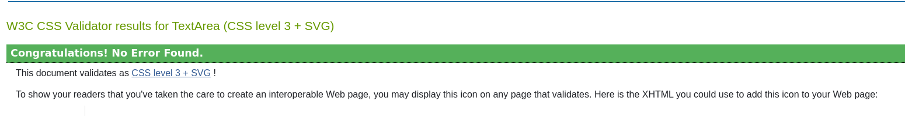

# Testing Document

## User Story Testing

### EPIC 1 - Store Management & Administration

- *As a site admin I can create, update and delete products within the store so that I can manage the items currently for sale.*

The site administrator has full access to CRUD functionality for all products, both from within the site front-end and also within the site admin panel. 

When logged in, the site administrator can add products through an "Add Product" option that appears in the user drop-down menu:

When logged in, the site administrator can edit and delete products through both the main store page and also the product details page. Edit and Delete buttons appear, only for the site administrator:

- *As a site admin I can update and delete registered users so that I can manage the users that have registered on the site.*

The site admin can edit and delete users from the site admin panel. They can delete existing users, add new users, and edit and manually verify the email addresses of registered users.

- *As a site administrator I can manage and respond to messages sent through the site contact form so that I can engage with my customers.*

The site admin can view all submissions sent through the Contact form from the site admin. They can mark each submission as "replied to" if they wish, to assist with contact management.

- *As a site admin I can review and approve customer reviews within the admin panel so that I can add customer reviews to my site, to improve trust in me as a seller.*

The site admin can approve, review and delete customer reviews from the site admin panel. They can also delete approved reviews from the site front-end if they wish to. The functionality to edit approved reviews on the front-end is also built-in, but not currently added to the Reviews template.

### EPIC 2 - User Interaction

- *As a site user I can contact the store owner so that I can send through questions or enquiries to the store owner.*

The user can contact the store by going to the "Contact" page in the main navigation or footer navigation, and filling out the form. The form submission triggers an email to go to the site admin, as well as adding an entry to the database.

- *As a site user I can add, edit and delete reviews of my experience on the site as a buyer so that I can express my views that inform future and existing users of the site.*

Site users can navigate to the "Customer Reviews" section in the footer navigation. They must log in to be able to leave a review. They can then add a review, where they can add their review title, write a description, and leave a rating 1 to 5, all of which appear on the site once their review has been approved.

Once the review is approved, the user can either edit or delete their own review, based on their choice. Edit/Delete buttons are present, to the user that left that particular review.

- *As a site user I can sign up to the store's newsletter so that I can receive updates on new products being added and/or promotions.*

The site visitor can sign up to a newsletter on the store homepage, to receive news relating to the store by email. The newsletter is set up via Mailchimp.

- *As a site user I can have the option to visit the store's social media accounts so that I can follow the store through these channels, to learn about current and future products for sale.*

The site user has access to the store's social media profiles in the site footer. There's links to Facebook, Twitter and Instagram along with a link to the store owner's personal Discogs profile.

### EPIC 3: Site Content & Navigation

- *As a Site User, I can navigate around the site so that I can find content that's relevant to what I am looking for.*

The site user has access to the main site navigation and footer navigation on all pages on the site. These are site-wide and appear no matter which page the visitor is viewing.

- *As a site user I can immediately understand the purpose of the site so that I can learn information about the website.*

This user story is covered by the general site content, which has been worked on throughout the project. The site is clearly structured, from the site title to the text and image content on the site, and its purpose is clear from all aspects. 

- *As a site user I can view a list of products so that I can select a product that I'm interested in, to view or purchase.*

The site user can browse a list of products for sale from the main navigation. By clicking into either the "genre" or "format" dropdown menus, they can click to view All Products. They can also click on the "Shop Now" action button in the middle of the homepage to reach the store.

Once they reach the store page, they can view a list of products for sale. The page is paginated to show 8 products at a time. They can move between sub-pages using the pagination navigation option at the bottom of the page. They can also add a product to their shopping bag from this page.

- *As a site user I can click on a product on the main Store page so that I can view extra information about the product.*

The user can click on either the product thumbnail or the product title on the product page to be taken to the product detail page. Once there, they can view extra details not visible on the product page, including the item condition and a full description. The option to Add to Cart is also present here, as is a "Back to All Products" button. 

- *As a site user I can browse the store by product category so that I can find music that's part of the genre I'm interested in.*

The user can browse by either album format or music genre from the main site navigation.

- *As a Site User I can find the Terms & Conditions and Privacy Policy applicable to this store so that I can have a better understanding of how this store operates and handles my data.*

The site user has access to these pages from the site footer.

- *As a site user I can find out what the item condition grades mean so that I will know what to expect in terms of item quality when I receive it."

The FAQ page in the site has information on this, and gives a detailed breakdown of what each condition grade means. This page is accessible from both the main navigation and the footer navigation.

### EPIC 4: eCommerce Functionality

- *As a site user I can add products to my shopping bag so that I can purchase them when ready.*

The site user has the option to add a chosen product to their cart from both the main store page and the product detail page. Once they add an item to their cart, they receive a browser message to let them know that the product has been added successfully to their cart.

- *As a site user I can view the contents of the shopping bag at any stage so that I can see the contents along with the current total cost.*

The site user can click on the Cart icon in the site header at any time, which takes them to the Shopping Bag page. Here, they can view all the products within the shopping bag at that particular time. The page also gives them a running total of their order, including order total, applicable shipping costs and amount to pay.

- *As a site user I can enter my payment details at checkout so that I can purchase the items in my shopping bag.*

After proceeding from the bag to the checkout, the customer can enter their card details securely in order to complete their purchase. The payment widget is embedded from Stripe, and takes care of the site payments. While the payment is being processed, the user will see a spinning wheel, indicating that the transaction is being processed. This should also discourage them from navigating away before the order is confirmed.

- *As a Site User I can purchase without registering, so that I can buy something without having to register for an account.*

No registration is required for a buy to be able to make a purchase from the site. The buyer can proceed through the checkout process without needing an account - they do, however, receive an option to create an account on the checkout page. 

- *As a Site User I can view a detailed order confirmation after checkout so that I can see all the details of the order I've placed.*

Once the order is completed, the shopper will see an order confirmation screen that details their order in full. They can also see this confirmation screen for previous orders from their user profile page.

- *As a site user I can receive an email to confirm my order so that I have a personal copy of the order that I've placed.*

An order confirmation is sent out from the store administrator email account to the email address added to the order at checkout.

### EPIC 5: User accounts & Profile

- *As a new site user I can create an account so that I can be a registered user.*

The visitor to the site can register for an account using the "Register" option in the main navigation bar. An option to create an account also exists at checkout.

- *As a site user I can verify my site membership through an email confirmation so that I can provide extra approval for my site membership.*

After signing up with an email address, username and password, the user will receive an email to the email address they provided, asking them to click the link to confirm their membership. This decreases the likelihood of spam accounts being created on the site, and also increases the security of the user themselves, as they can lower the risk of being subscribed to a site that they didn't agree to.

- *As a registered site user I can log in or log out of my account as appropriate so that I can access my user account as required.*

The user can log in and out of their account from the main navigation bar. If logged out, an option will exist to either register or log in. If already logged in, the registration option disappears and a "Logout" option appears the user account dropdown menu.

- *As a site user I can recover or reset my password so that I can gain access to the logged-in features if I have forgotten my login details.*

An option exists for the user to reset their password if they have forgotten it. This option is visible on the login screen, and also on the registration page. Clicking on this option will take them to the password recovery page.

- *As a Site User I can view and update my registered shipping address and view previous orders so that I can ensure that my shipping address is correct and view information relating to previous orders.*

The logged-in user can access their profile through the user account dropdown menu in the main navigation. Here, they can update their registered shipping address and view their previous orders. There's also an option to change their login password if they wish to do that.

## Code Validation

### HTML

The following results were seen when passing my code through the [W3C HTML Validator](https://validator.w3.org/):

| Page               | Logged Out | Logged In |
|--------------------|------------|-----------|
| Home               | No errors  | No errors |
| Products           | No errors  | No errors |
| Product Detail     | No errors  | No errors |
| Add Product        | N/A        | Note      |
| Edit Product       | N/A        | Note      |
| Bag                | No errors  | No errors |
| Checkout           | No errors  | No errors |
| Checkout Success   | No errors  | No errors |
| Profile Page       | N/A        | No errors |
| FAQs               | No errors  | No errors |
| Privacy Policy     | No errors  | No errors |
| Terms & Conditions | No errors  | No errors |
| Reviews            | No errors  | No errors |
| Add Review         | No errors  | No errors |
| Edit Review        | No errors  | No errors |
| Contact            | No errors  | No errors |
| Sign In            | No errors  | N/A       |
| Register           | No errors  | N/A       |
| Sign Out           | N/A        | No errors |
| Password Reset     | No errors  | N/A       |
| Password Change    | N/A        | No errors |
| 404 Error Page     | No errors  | No errors |
| 403 Error Page     | No errors  | No errors |

NOTE: The Add Products and Edit Products pages include some validation errors caused by the Summernote WYSIWYG text editor. These are outside of my control.

Also, forms that include an image upload field return this error in the HTML validator. This is to do with the image upload widget, and changing this breaks the field entirely.

### CSS

No errors were returned when passing my CSS through the [W3C CSS Validator](https://jigsaw.w3.org/css-validator/).

*base.css*

*checkout.css*

*profile.css*

### Python

I used the [PEP8 Python Validator](https://pep8ci.herokuapp.com/) provided by Code Institute for my Python testing. No errors were returned, apart from some line-length errors in my settings.py file, where are auto-generated.

### JavaScript

No JavaScript errors were returned when testing in the [JSHint](https://jshint.com/) validator.

## Lighthouse Testing

The Lighthouse test in Chrome Developer Tools was run on all pages to check performance and accessibility. The below scores were achieved:

| Page             | Performance | Accessibility | Best Practices | SEO |
|------------------|-------------|---------------|----------------|-----|
| Home             | 92          | 98            | 100            | 100 |
| Products         | 91          | 98            | 100            | 100 |
| Product Detail   | 98          | 98            | 100            | 100 |
| Contact          | 95          | 98            | 100            | 100 |
| FAQ              | 95          | 98            | 100            | 100 |
| T&C              | 98          | 98            | 100            | 100 |
| Privacy Policy   | 98          | 98            | 100            | 100 |
| Add Product      | 98          | 90            | 100            | 100 |
| Edit Product     | 98          | 91            | 100            | 100 |
| Bag              | 91          | 98            | 100            | 100 |
| Checkout         | 92          | 95            | 100            | 100 |
| Checkout Success | 98          | 98            | 100            | 100 |
| Reviews          | 97          | 98            | 100            | 100 |
| Add Review       | 96          | 91            | 100            | 100 |
| Edit Review      | 95          | 91            | 100            | 100 |
| Sign In          | 95          | 98            | 100            | 100 |
| Sign Out         | 98          | 98            | 100            | 100 |
| Register         | 96          | 98            | 100            | 100 |
| Password Reset   | 96          | 98            | 100            | 100 |
| Change Password  | 96          | 98            | 100            | 100 |

## Manual Testing

### Site Navigation

**Desktop**

| Element            | Action  | Expected Outcome                                   | Pass/Fail |
|--------------------|---------|----------------------------------------------------|-----------|
| Navigation Bar     |         |                                                    |           |
| Navigation Links   | Hover   | Font darkens on hover                              | Pass      |
| Site Title         | Click   | Returns to homepage                                | Pass      |
| Home link          | Click   | Returns to homepage                                | Pass      |
| By Format          | Click   | Opens dropdown menu                                | Pass      |
| All Products       | Click   | Return all products in the store                   | Pass      |
| Format options     | Click   | Return only items tagged with that format          | Pass      |
| By Genre           | Click   | Opens dropdown menu                                | Pass      |
| All Products       | Click   | Return all products in the store                   | Pass      |
| Genre options      | Click   | Return only items tagged with that genre           | Pass      |
| Contact            | Click   | Opens Contact page                                 | Pass      |
| FAQ’s              | Click   | Opens FAQs page                                    | Pass      |
| Register           | Click   | Opens signup page                                  | Pass      |
| Login              | Click   | Opens login page                                   | Pass      |
| Cart icon          | Display | Should show running total of customer order        | Pass      |
| Register           | Display | Should not appear if user is logged in             | Pass      |
| Login              | Display | Should not appear if user is logged in             | Pass      |
| User dropdown menu | Display | Should show name of user                           | Pass      |
| User dropdown menu | Click   | Opens dropdown menu                                | Pass      |
| User dropdown menu | Display | Should show profile option and option to log out   | Pass      |
| User dropdown menu | Display | Should allow only the store admin to add a product | Pass      |
| My Profile link    | Click   | Opens user profile page                            | Pass      |
| Add product link   | Click   | Opens Add Product page                             | Pass      |
| Logout             | Click   | Opens logout page                                  | Pass      |

**Mobile**

| Element            | Action  | Expected Outcome                                   | Pass/Fail |
|--------------------|---------|----------------------------------------------------|-----------|
| Navigation Bar     |         |                                                    |           |
| Hamburger Menu     | Display | Appear at 992px breakpoint                         | Pass      |
| Hamburger Menu     | Tap     | Displays navigation items                          | Pass      |
| Site Title         | Tap     | Returns to homepage                                | Pass      |
| Home link          | Tap     | Returns to homepage                                | Pass      |
| By Format          | Tap     | Opens and closes dropdown menu                     | Pass      |
| All Products       | Tap     | Return all products in the store                   | Pass      |
| Format options     | Tap     | Return only items tagged with that format          | Pass      |
| By Genre           | Tap     | Opens and closes dropdown menu                     | Pass      |
| All Products       | Tap     | Return all products in the store                   | Pass      |
| Genre options      | Tap     | Return only items tagged with that genre           | Pass      |
| Contact            | Tap     | Opens Contact page                                 | Pass      |
| FAQ’s              | Tap     | Opens FAQs page                                    | Pass      |
| Register           | Tap     | Opens signup page                                  | Pass      |
| Login              | Tap     | Opens login page                                   | Pass      |
| Cart icon          | Display | Should show running total of customer order        | Pass      |
| Register           | Display | Should not appear if user is logged in             | Pass      |
| Login              | Display | Should not appear if user is logged in             | Pass      |
| User dropdown menu | Display | Should show name of user                           | Pass      |
| User dropdown menu | Click   | Opens dropdown menu                                | Pass      |
| User dropdown menu | Display | Should show profile option and option to log out   | Pass      |
| User dropdown menu | Display | Should allow only the store admin to add a product | Pass      |
| My Profile link    | Click   | Opens user profile page                            | Pass      |
| Add product link   | Click   | Opens Add Product page                             | Pass      |
| Logout             | Click   | Opens logout page                                  | Pass      |

### Footer

| Element               | Action  | Expected Outcome                                     | Pass/Fail |
|-----------------------|---------|------------------------------------------------------|-----------|
| Footer                | Display | Show footer navigation, social links and site credit | Pass      |
| Home link             | Click   | Open homepage                                        | Pass      |
| T&C Link              | Click   | Open T&C Page                                        | Pass      |
| Privacy Link          | Click   | Open Privacy page                                    | Pass      |
| FAQs Link             | Click   | Open FAQs page                                       | Pass      |
| Customer Reviews link | Click   | Open Customer Reviews page                           | Pass      |
| Contact Us link       | Click   | Open Contact page                                    | Pass      |
| Social Media links    | Click   | Open correct social profile in new tab               | Pass      |
| Personal credit link  | Click   | Open my personal website link                        | Pass      |

### Home Page

| Element          | Action   | Expected Result                            | Pass/Fail |
|------------------|----------|--------------------------------------------|-----------|
| Shop Now button  | Click    | Open Store page                            | Pass      |
| Newsletter Block | Interact | Accept email address and show confirmation | Pass      |

### Allauth pages

| Element                     | Action                                 | Expected Outcome                                | Pass/Fail |
|-----------------------------|----------------------------------------|-------------------------------------------------|-----------|
| Signup page                 |                                        |                                                 |           |
| Sign In Link                | Click                                  | Open login page                                 | Pass      |
| Password Reset link         | Click                                  | Open password reset page                        | Pass      |
| Email field                 | Insert non-email address               | On submit – submit fail, error message displays | Pass      |
| Email field                 | Leave empty                            | On submit – submit fail, error message displays | Pass      |
| Email field                 | Insert duplicate email address         | On submit – submit fail, error message displays | Pass      |
| Email field                 | Insert valid input                     | On submit – form submits                        | Pass      |
| Email confirmation field    | Insert different email address         | On submit – submit fail, error message displays | Pass      |
| Email confirmation field    | Insert valid input                     | On submit – form submits                        | Pass      |
| Username field              | Insert invalid/empty input             | On submit – submit fail, error message displays | Pass      |
| Username field              | Insert duplicate username              | On submit – submit fail, error message displays | Pass      |
| Username field              | Insert valid input                     | On submit – form submits                        | Pass      |
| Password fields             | Insert invalid/empty input             | On submit – submit fail, error message displays | Pass      |
| Password fields             | Passwords don’t match                  | On submit – submit fail, error message displays | Pass      |
| Password fields             | Insert valid input and passwords match | On submit – form submits                        | Pass      |
| Sign Up button (form valid) | Click                                  | Form submits                                    | Pass      |
| Sign Up button (form valid) | Click                                  | Redirect to email verification page             | Pass      |
| Sign Up button (form valid) | Click                                  | Alert message to say verification email sent    | Pass      |
| Back to Login button        | Click                                  | Open login page                                 | Pass      |
|                             |                                        |                                                 |           |
| Login page                  |                                        |                                                 |           |
| Sign up link                | Click                                  | Open signup page                                | Pass      |
| Username/email field        | Leave empty                            | On submit – submit fail, error message displays | Pass      |
| Username/email field        | Invalid input                          | On submit – submit fail, error message displays | Pass      |
| Password field              | Leave empty                            | On submit – submit fail, error message displays | Pass      |
| Password field              | Insert wrong password                  | On submit – submit fail, error message displays | Pass      |
| Login button (Form valid)   | Click                                  | Form submits                                    | Pass      |
| Login button (Form valid)   | Click                                  | Redirect to homepage                            | Pass      |
| Login button (Form valid)   | Click                                  | Success message appears                         | Pass      |
| Sign Up link                | Click                                  | Open signup page                                | Pass      |
| Forgot password link        | Click                                  | Open password reset page                        | Pass      |
| Home link                   | Click                                  | Open homepage                                   | Pass      |
|                             |                                        |                                                 |           |
| Sign Out confirmation page  |                                        |                                                 |           |
| Sign Out button             | Click                                  | User is successfully logged out                 | Pass      |
| Sign Out button             | Click                                  | Success message confirming logout appears       | Pass      |

### Store Page

| Element            | Action  | Expected Outcome                                                | Pass/Fail |
|--------------------|---------|-----------------------------------------------------------------|-----------|
| Product            | Display | Display thumbnail image, title, artist, format, genre and price | Pass      |
| Product            | Display | Display products in a random order on page load                 | Pass      |
| Thumbnail          | Click   | Open product detail page                                        | Pass      |
| Product Title      | Click   | Open product detail page                                        | Pass      |
| Add To Cart        | Click   | Adds item to cart                                               | Pass      |
| Add to Cart        | Click   | Updates running total in cart icon in header                    | Pass      |
| Edit button        | Display | Should only be visible to store admin                           | Pass      |
| Delete button      | Display | Should only be visible to store admin                           | Pass      |
| Edit button        | Click   | Opens Edit Product page                                         | Pass      |
| Delete button      | Click   | Opens Delete Product modal                                      | Pass      |
| Page pagination    | Display | Page should only show 8 products at once                        | Pass      |
| Pagination buttons | Click   | Takes user back and forth between sub-pages                     | Pass      |

### Product Detail page

| Element                  | Action  | Expected Outcome                                                                | Pass/Fail |
|--------------------------|---------|---------------------------------------------------------------------------------|-----------|
| Product content          | Display | Display details about the product, extended description plus Add to Cart button | Pass      |
| Edit button              | Display | Should only be visible to store admin                                           | Pass      |
| Delete button            | Display | Should only be visible to store admin                                           | Pass      |
| Edit button              | Click   | Opens Edit Product page                                                         | Pass      |
| Delete button            | Click   | Opens Delete Product modal                                                      | Pass      |
| Add To Cart              | Click   | Adds item to cart                                                               | Pass      |
| Add to Cart              | Click   | Updates running total in cart icon in header                                    | Pass      |
| Continue Shopping button | Click   | Opens all products page                                                         | Pass      |

### Shopping Bag page

| Element                     | Action  | Expected Outcome                                                                   | Pass/Fail |
|-----------------------------|---------|------------------------------------------------------------------------------------|-----------|
| Bag page                    | Display | Show all items currently in the bag                                                | Pass      |
| Bag page                    | Display | Allow customer to remove items from bag                                            | Pass      |
| Bag page                    | Display | Alert customer to free shipping threshold                                          | Pass      |
| Bag page                    | Display | Keep Shopping button                                                               | Pass      |
| Bag page                    | Display | Continue to Checkout button                                                        | Pass      |
| Bag page                    | Display | Show order running total, shipping cost and grand total                            | Pass      |
| Keep Shopping button        | Click   | Opens All Products page                                                            | Pass      |
| Continue to Checkout button | Click   | Open Checkout page                                                                 | Pass      |
| Remove button               | Click   | Remove item from bag and update totals                                             | Pass      |
| Remove button               | Click   | Alert message appears to confirm item removal                                      | Pass      |
| Bag page                    | Display | When empty, only show “continue shopping” button plus message stating bag is empty | Pass      |

### Store Checkout

| Element                    | Action                     | Expected Outcome                                             | Pass/Fail |
|----------------------------|----------------------------|--------------------------------------------------------------|-----------|
| Checkout page              | Direct URL                 | With items in bag – go to checkout page                      | Pass      |
| Checkout page              | Direct URL                 | Bag empty – redirect to store page with message              | Pass      |
| Form fields                | On page load               | If logged in – fields populated from user profile (if saved) | Pass      |
| Form fields                | On page load               | If logged out or if profile not saved – blank fields         | Pass      |
| Required Text input fields | Leave empty                | Browser error, form doesn’t submit                           | Pass      |
| Required Text input fields | Whitespace                 | Browser error, form doesn’t submit                           | Pass      |
| Required Text input fields | Filled in correctly        | Form submits                                                 | Pass      |
| Phone number field         | Leave empty                | Browser error, form doesn’t submit                           | Pass      |
| Phone number field         | Whitespace                 | Browser error, form doesn’t submit                           | Pass      |
| Phone number field         | Add non-numeric characters | Browser error, form doesn’t submit                           | Pass      |
| Phone number field         | Filled in correctly        | Form submits                                                 | Pass      |
| Email field                | Leave empty                | Browser error, form doesn’t submit                           | Pass      |
| Email field                | Whitespace                 | Browser error, form doesn’t submit                           | Pass      |
| Email field                | Add a non-email address    | Browser error, form doesn’t submit                           | Pass      |
| Email field                | Filled in correctly        | Form submits                                                 | Pass      |
| Country field dropdown     | Click                      | Show dropdown options                                        | Pass      |
| Save to profile checkbox   | On page load – logged in   | Shown to user                                                | Pass      |
| Save to profile checkbox   | On page load – logged out  | Not shown to user                                            | Pass      |
| Save to profile checkbox   | Box checked                | On submit, details saved to user profile                     | Pass      |
| Save to profile checkbox   | Box unchecked              | On submit, details not saved to profile                      | Pass      |
| Card input field           | Invalid card number input  | Error message on field                                       | Pass      |
| Card input field           | Invalid card date input    | Error message on field                                       | Pass      |
| Card input field           | Details all valid          | Purchase completed                                           | Pass      |
| Adjust Bag button          | Click                      | Return to Bag page                                           | Pass      |
| Complete Order button      | Click – form invalid       | Error message appears on invalid fields                      | Pass      |
| Complete Order button      | Click – form valid         | Loading screen appears                                       | Pass      |
| Complete Order button      | Click – form valid         | Form submits                                                 | Pass      |
| Complete Order button      | Click – form valid         | Redirect to order confirmation page                          | Pass      |
| Complete Order button      | Click – form valid         | Order saved to customer profile                              | Pass      |
|                            |                            |                                                              |           |
| Checkout Success page      |                            |                                                              |           |
| Order confirmation         | Display                    | Display the correct order details                            | Pass      |

### Reviews

**Reviews Page**

| Element                        | Action  | Expected Outcome                                                      | Pass/Fail |
|--------------------------------|---------|-----------------------------------------------------------------------|-----------|
| Reviews page                   | Display | Display a list of approved customer reviews                           | Pass      |
| Reviews page – user logged out | Display | Show a list of previous customer reviews                              | Pass      |
| Reviews page – user logged out | Display | Display a message saying that you must be logged in to leave a review | Pass      |
| Reviews page – user logged in  | Display | Option to leave a review                                              | Pass      |
| Reviews page – user logged in  | Display | Option to edit existing review left by the user                       | Pass      |
| Reviews page – user logged in  | Display | Option to delete existing review left by the user                     | Pass      |
| Leave A Review button          | Click   | Open Add Review page                                                  | Pass      |
| Edit button                    | Display | Only available on reviews left by the logged-in user                  | Pass      |
| Delete button                  | Display | Only available on reviews left by the logged-in user                  | Pass      |
| Edit button                    | Click   | Open Edit Review page                                                 | Pass      |
| Delete button                  | Click   | Trigger Delete Review modal                                           | Pass      |

**Add Review page**

| Element         | Action  | Expected Outcome                                              | Pass/Fail |
|-----------------|---------|---------------------------------------------------------------|-----------|
| Add Review page | Display | Display logged-in user                                        | Pass      |
| Add Review page | Display | Form to add review, image, rating and review title            | Pass      |
| Use direct URL  | Link    | Logged in – open Add Review Page                              | Pass      |
| Use direct URL  | Link    | Logged out – return to Sign In page                           | Pass      |
| Submit button   | Click   | Form valid – return to Reviews page with confirmation message | Pass      |
| Submit button   | Click   | Form invalid – browser error, form not submitted              | Pass      |

**Edit Review page**

| Element          | Action           | Expected Outcome                                                                                                                                    | Pass/Fail |
|------------------|------------------|-----------------------------------------------------------------------------------------------------------------------------------------------------|-----------|
| Edit Review page | Display          | Display a form autopopulated with the original review                                                                                               | Pass      |
| Edit Review page | Access           | Logged out – use direct link takes you to login page                                                                                                | Pass      |
| Edit Review page | Access           | If a logged-in user tries to edit another user’s review by using the direct link, they’re returned to a custom 403 error pageand are refused access | Pass      |
| Review Title     | Leave blank      | Browser error, form does not submit                                                                                                                 | Pass      |
| Review Title     | Whitespace       | Browser error, form does not submit                                                                                                                 | Pass      |
| Review Title     | Valid field      | Form submits, review is updated                                                                                                                     | Pass      |
| Body field       | Leave blank      | Browser error, form does not submit                                                                                                                 | Pass      |
| Body field       | Whitespace       | Browser error, form does not submit                                                                                                                 | Pass      |
| Body field       | Valid field      | Form submits, review is updated                                                                                                                     | Pass      |
| Rating field     | Valid field      | Form submits, review is updated                                                                                                                     | Pass      |
| Image field      | Upload new image | Form submits, review is updated                                                                                                                     | Pass      |

**Delete Review modal**

| Element             | Action  | Expected Outcome                                               | Pass/Fail |
|---------------------|---------|----------------------------------------------------------------|-----------|
| Delete review modal | Display | Display button to delete review and also to close the modal    | Pass      |
| Delete button       | Click   | Delete review and return to Reviews page                       | Pass      |
| Close button        | Click   | Close the modal without deleting any reviews from the database | Pass      |

### Profile Pages

| Element                | Action               | Expected Outcome                                                                                                  | Pass/Fail |
|------------------------|----------------------|-------------------------------------------------------------------------------------------------------------------|-----------|
| Profile Page           |                      |                                                                                                                   |           |
| Profile page           | Display              | Show the user’s stored shipping address, change password button and order history                                 | Pass      |
| Open profile page      | Access               | If a user tries to access the profile URL directly without being signed in, they are returned to the login screen | Pass      |
| Form fields            | Page load            | Fields load with user’s saved personal and shipping details                                                       | Pass      |
| Input fields           | Leave blank          | Submit – form submits                                                                                             | Pass      |
| Input fields           | Whitespace           | Submit – form submits                                                                                             | Pass      |
| Input fields           | Update with new info | Submit – form submits                                                                                             | Pass      |
| Form dropdown          | Click                | Dropdown options are displayed                                                                                    | Pass      |
| Update button          | Click                | Form submits                                                                                                      | Pass      |
| Update button          | Click                | Success message is issued                                                                                         | Pass      |
| Previous order number  | Click                | Open previous order                                                                                               | Pass      |
| Previous order number  | Click                | Display message notifying that this is a previous order, not a new order                                          | Pass      |
|                        |                      |                                                                                                                   |           |
| Previous order page    |                      |                                                                                                                   |           |
| Page content           | Display              | Display details of previous order, order date, and message informing that its a previous order                    | Pass      |
| Back to Profile button | Click                | Return to user profile page                                                                                       | Pass      |

### Contact page

| Element       | Action                  | Expected Outcome                                             | Pass/Fail |
|---------------|-------------------------|--------------------------------------------------------------|-----------|
| Page display  | Display                 | Show contact form with fields to submit message              | Pass      |
| Text field    | Input whitespace        | Browser error, form won’t submit                             | Pass      |
| Text field    | Leave blank             | Browser error, form won’t submit                             | Pass      |
| Email field   | Enter non email address | Browser error, form won’t submit                             | Pass      |
| Submit button | Click                   | If form valid, submits form                                  | Pass      |
| Submit button | Click                   | If form invalid, returns error and redirects to Contact page | Pass      |

## Bugs

### Resolved bugs

**Checkout page**

When testing the checkout page, I found that adding whitespace to the text fields resulted in a 500 server error message, although the order was still being submitted and the Stripe payment was being processed. To prevent this from happening, I added a custom pattern attribute widget to the checkout form, which uses the information in the Code Institute Boutique Ado walkthrough project as a starting point. I used [this](https://www.geeksforgeeks.org/html-pattern-attribute) article as a reference point for learning about HTML pattern attributes, and [this](https://stackoverflow.com/questions/19122886/how-can-i-create-a-custom-message-when-an-html5-required-input-pattern-does-not) Stack Overflow thread for help with writing a custom JavaScript funtion, which I added to the Checkout template as a post-load so as to return a relevant and helpful error message to the user.

It would obviously be better to find a way to fully validate the form on the server side before submitting the form. however due to time constraints I have not been able to research and implement this. This will be looked at in the future.

**Heroku deployment**

On my initial deploys to Heroku, my deployments failed due to the error "Could not build wheels for backports.zoneinfo". I discovered that Heroku uses Python version 3.10 by default, which is not compatible with backports.zoneinfo - to resolve this, I created a custom runtime.txt file in my root directory to specify the version of Python for Heroku to install. I also had to downgrade to Heroku-20 to use this version of Python, as Heroku-22 does not support Python version 3.8.15. The Heroku downgrade and the runtime.txt addition solved the deployment issues, and I was able to deploy my site successfully.

### Unresolved bugs

**Add/Edit Product pages**

The Summernote widget embedded into these pages for text formatting options is not fully mobile responsive. Therefore, we suggest adding/editing products from a widescreen/desktop browser when possible. As this is an embedded Django package, it's not fully within my control in terms of mobile responsiveness. It is a low impact bug, as it would only affect the store administrator adding/editing products on a mobile device.

No other unresolved bugs have been detected during my testing process. The site works as I intend it to.